# 🎯 APOLLO EDGE

## *Institutional-Grade Prediction Market Intelligence*

<div align="center">

```
╔═══════════════════════════════════════════════════════════════════════╗
║                                                                       ║
║   █████╗ ██████╗  ██████╗ ██╗     ██╗      ██████╗                    ║
║  ██╔══██╗██╔══██╗██╔═══██╗██║     ██║     ██╔═══██╗                   ║
║  ███████║██████╔╝██║   ██║██║     ██║     ██║   ██║                   ║
║  ██╔══██║██╔═══╝ ██║   ██║██║     ██║     ██║   ██║                   ║
║  ██║  ██║██║     ╚██████╔╝███████╗███████╗╚██████╔╝                   ║
║  ╚═╝  ╚═╝╚═╝      ╚═════╝ ╚══════╝╚══════╝ ╚═════╝  EDGE              ║
║                                                                       ║
║        Whale Detection • Cross-Chain Tracing • Live Arbitrage        ║
║                   Automated Sniping • NFL Props                       ║
║                                                                       ║
╚═══════════════════════════════════════════════════════════════════════╝
```

[](https://www.python.org/downloads/)
[](https://opensource.org/licenses/MIT)
[](https://polymarket.com)

</div>

---

## 🚀 What Is Apollo Edge?

Apollo Edge is an **institutional-grade trading intelligence system** for prediction markets. It detects whale movements, traces cross-chain fund flows, identifies arbitrage opportunities, and can execute trades in sub-second timeframes.

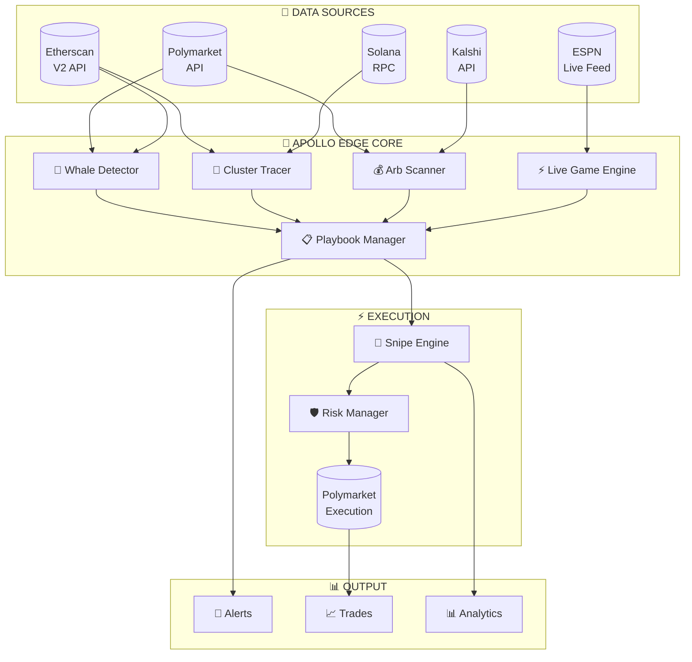

---

## 🎯 Core Capabilities

### 🐋 **Whale Detection & Sniping**

Monitors Polymarket in real-time, detects large positions (>$10K), and can automatically follow whale trades.

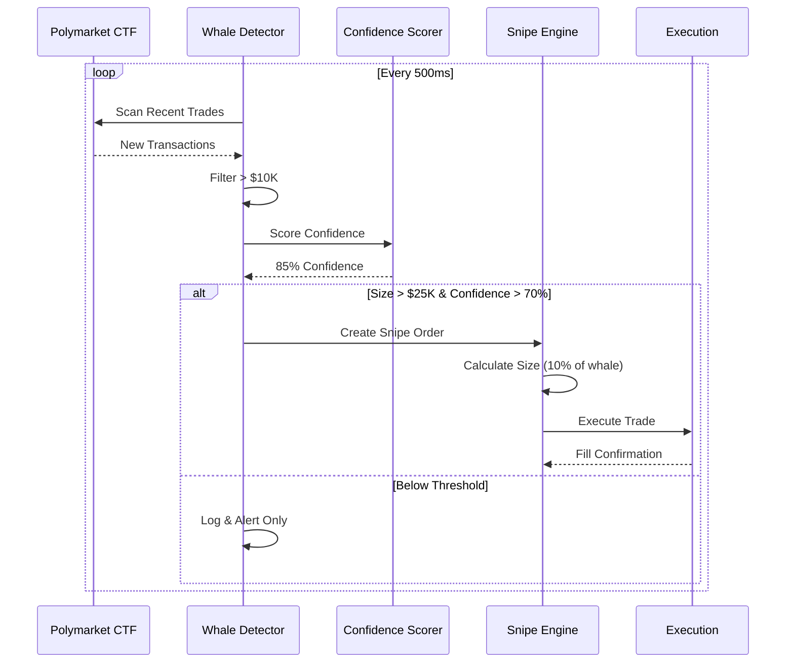

### 🔗 **5-Hop Cross-Chain Tracing**

Traces funding sources from Polygon back through Wormhole bridges to Solana, identifying original CEX sources.

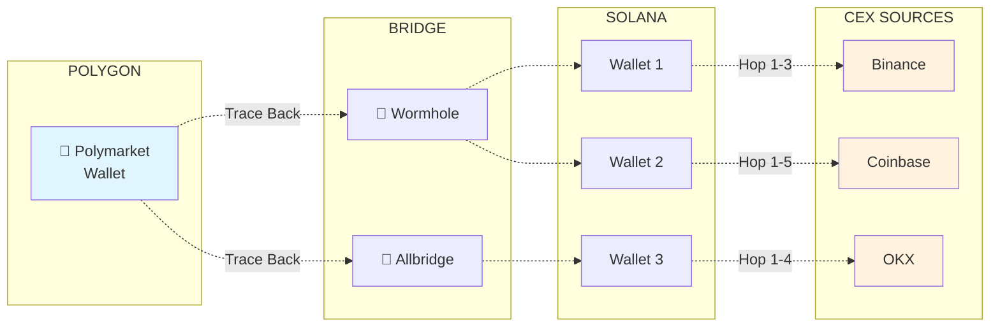

### ⚡ **Live Game Arbitrage**

Detects game events (touchdowns, injuries) faster than sportsbooks can update odds, creating arbitrage windows.

```mermaid
gantt
    title Live Game Arbitrage Timeline
    dateFormat X
    axisFormat %Lms

    section Event Detection
    Touchdown Scored       :done, 0, 50
    ESPN API Detects       :done, 50, 100
    Apollo Edge Alerts     :done, 100, 150

    section Our Execution
    Create Order           :active, 150, 175
    Submit to Polymarket   :active, 175, 225
    Order Filled           :crit, 225, 275

    section Sportsbook Lag
    Book Notices Event     :5000, 10000
    Book Updates Odds      :10000, 20000
    Arb Window Closes      :20000, 30000
```

### 📋 **Automated Playbooks**

Pre-configured trading strategies that auto-execute based on customizable conditions.

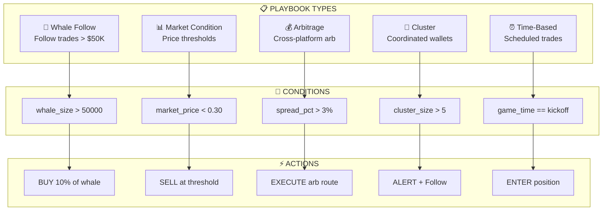

---

## 📊 System Architecture

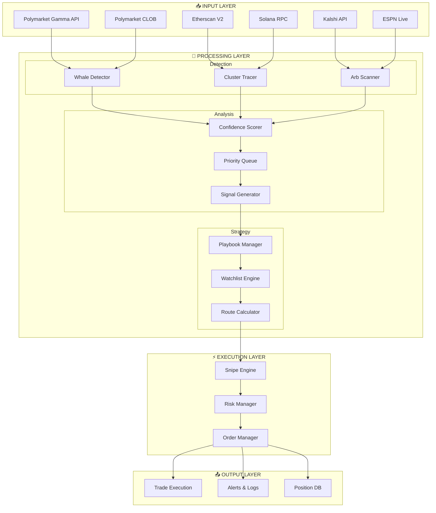

---

## 🏁 Quick Start

### 1. Install Dependencies

```bash
pip install requests aiohttp websocket-client
```

### 2. Run the System

```bash
# Interactive menu (no wallet needed)
python launch.py

# Or use direct commands
python launch.py --whales      # Find whale positions
python launch.py --arb         # Scan arbitrage opportunities
python launch.py --props       # NFL props scanner
python launch.py --clusters    # Cluster analysis demo
```

### 3. For Live Trading

```bash
# Copy config template
cp config_template.py config.py

# Edit config.py with your wallet details
# Set PAPER_TRADING_MODE = False

# Start sniping
python launch.py --snipe
```

---

## 📁 Project Structure

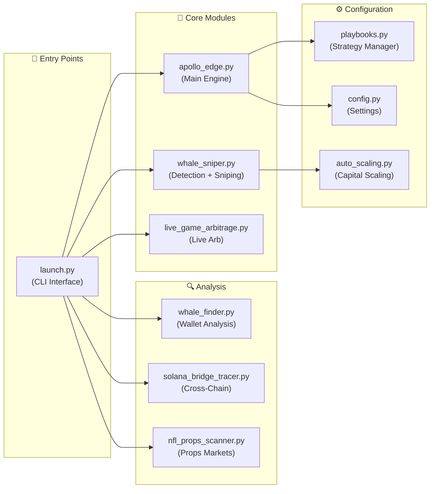

| File | Description |
|------|-------------|
| `launch.py` | Interactive CLI with menu system |
| `apollo_edge.py` | Main orchestration engine |
| `whale_sniper.py` | Real-time whale detection & auto-sniping |
| `live_game_arbitrage.py` | Sub-second live game event detection |
| `whale_finder.py` | Wallet analysis & 5-hop tracing |
| `solana_bridge_tracer.py` | Cross-chain Solana → Polygon tracing |
| `nfl_props_scanner.py` | Comprehensive NFL props market coverage |
| `playbooks.py` | Automated strategy playbooks |
| `auto_scaling.py` | Dynamic capital-based position sizing |
| `config.py` | Centralized configuration |

---

## 🐋 Whale Detection Flow

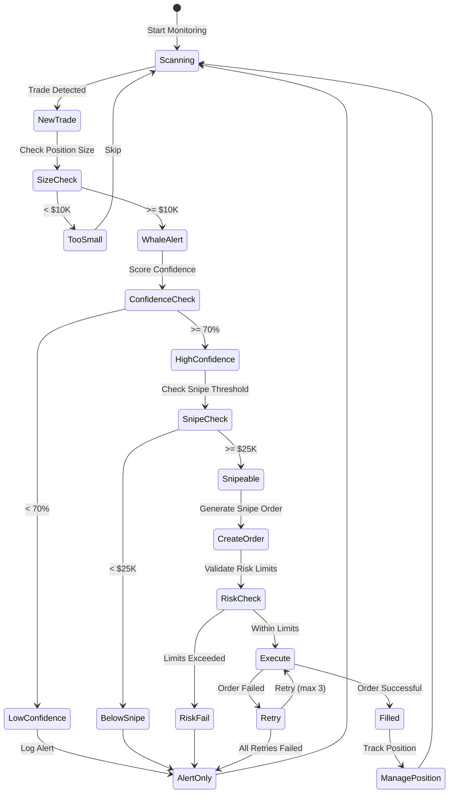

---

## 💰 Auto-Scaling Capital Management

The system automatically adjusts trading parameters based on your wallet balance:

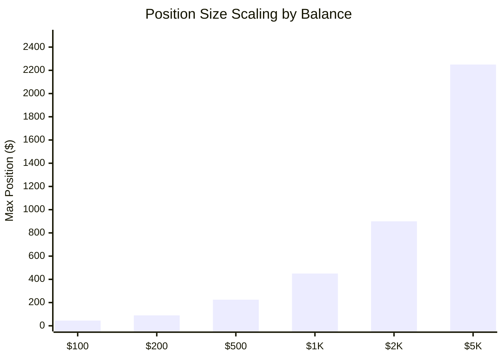

| Balance | Max/Trade | Positions | Daily Trades | Follow % |
|---------|-----------|-----------|--------------|----------|
| $100 | $45 | 1 | 5 | 1% |
| $200 | $90 | 1 | 5 | 1% |
| $500 | $225 | 2 | 10 | 2% |
| $1,000 | $450 | 2 | 15 | 5% |
| $2,000 | $900 | 3 | 20 | 10% |
| $5,000 | $2,250 | 4 | 20 | 10% |

---

## 🏈 NFL Props Coverage

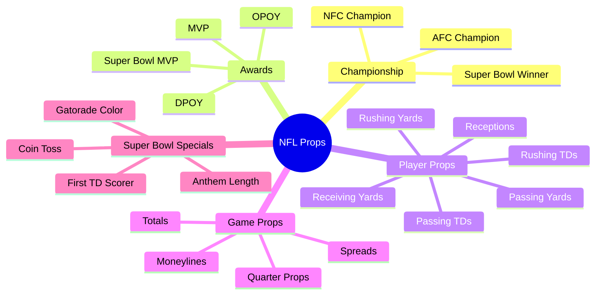

---

## ⚡ Speed Optimizations

Apollo Edge is built for **millisecond-level execution**:

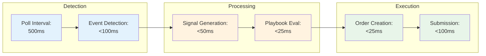

**Target Latencies:**
- Event Detection: <500ms
- Trade Execution: <100ms
- Total Event-to-Fill: <1 second

---

## 🛡️ Risk Management

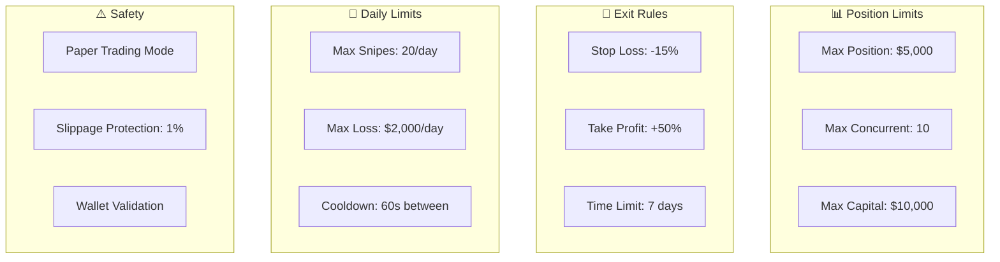

---

## 🔌 API Integrations

| API | Purpose | Status |
|-----|---------|--------|
| **Polymarket Gamma** | Market data, prices | ✅ Active |
| **Polymarket CLOB** | Orderbook, execution | ✅ Active |
| **Kalshi** | Cross-platform arb | ✅ Active |
| **Etherscan V2** | On-chain tracing | ✅ Active |
| **ESPN** | Live game events | ✅ Active |
| **Solana RPC** | Cross-chain tracing | ✅ Active |
| **Wormhole** | Bridge transaction lookup | ✅ Active |

---

## 📈 Command Reference

### Interactive Mode
```bash
python launch.py
```

### Direct Commands
```bash
# Whale Operations
python launch.py --whales                    # Find whales
python launch.py --snipe                     # Active sniping
python launch.py --monitor                   # Passive monitoring

# Analysis
python launch.py --clusters                  # Cluster analysis
python launch.py --wallet 0x...              # Analyze wallet
python launch.py --arb                       # Arbitrage scan

# Markets
python launch.py --props                     # NFL props

# System
python launch.py --full                      # Full system
python launch.py --status                    # View status
```

### Individual Modules
```bash
python whale_sniper.py --mode=demo
python apollo_edge.py --mode=scan
python nfl_props_scanner.py
python solana_bridge_tracer.py --polygon-address 0x...
```

---

## ⚙️ Configuration

Create `config.py` from the template:

```python
# === WALLET CONFIGURATION ===
TRADING_WALLET_ADDRESS = "0x..."
TRADING_WALLET_PRIVATE_KEY = "..."  # Never share!
PAPER_TRADING_MODE = True           # Start with paper trading

# === DETECTION THRESHOLDS ===
MIN_WHALE_SIZE_USD = 10000          # Minimum to track
SNIPE_THRESHOLD_USD = 25000         # Minimum to auto-snipe
MIN_CONFIDENCE_SCORE = 70           # Minimum confidence

# === EXECUTION ===
FOLLOW_PERCENTAGE = 0.10            # Follow 10% of whale
MAX_POSITION_SIZE_USD = 5000        # Max per trade
MAX_SLIPPAGE_PCT = 1.0              # Slippage tolerance

# === RISK MANAGEMENT ===
STOP_LOSS_PCT = 15.0                # Auto stop-loss
TAKE_PROFIT_PCT = 50.0              # Auto take-profit
MAX_DAILY_SNIPES = 20               # Daily limit
MAX_DAILY_LOSS_USD = 2000           # Loss limit
```

---

## 🎓 How It Works

### The Edge: Following Smart Money

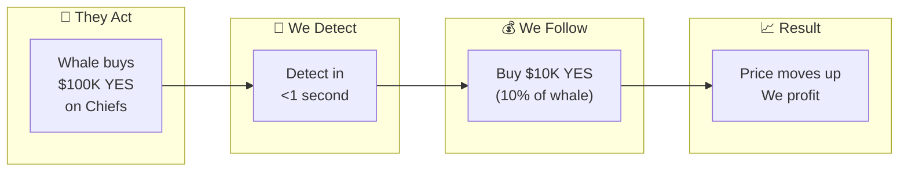

### The Cross-Chain Trace

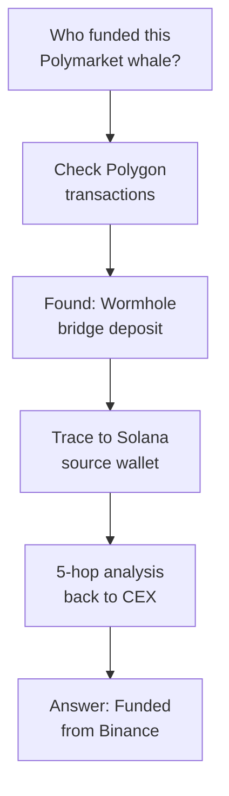

---

## 📊 Sample Output

```
╔═══════════════════════════════════════════════════════════════════════╗
║                    APOLLO EDGE - NFL BETTING INTELLIGENCE              ║
╚═══════════════════════════════════════════════════════════════════════╝

[12:34:56] 🐋 WHALE DETECTED: $87,500 BUY on Chiefs -3.5
           Wallet: 0x7a23...4f2b
           Confidence: 89%
           ⚡ SNIPING: $8,750 (10% follow)

[12:34:56] ✅ SNIPE EXECUTED
           Fill Price: 0.62
           Est. Profit: +$4,200 at 0.85

[12:35:12] 💰 ARBITRAGE FOUND
           Chiefs ML: Polymarket 0.58 / Kalshi 0.63
           Spread: 5.2%
           Max Size: $15,000
           
[12:35:30] 🏈 LIVE EVENT: Touchdown KC
           Detected in: 89ms
           Arb Window: ~15 seconds
           Executing...
```

---

## 🤝 Contributing

Contributions are welcome! Please feel free to submit a Pull Request.

---

## ⚠️ Disclaimer

This software is for educational purposes only. Trading prediction markets involves significant risk. Never trade with money you can't afford to lose. Past performance does not guarantee future results.

---

## 📄 License

MIT License - see LICENSE file for details.

---

<div align="center">

**Built for the next generation of prediction market traders**

🐋 Detect Whales • 🔗 Trace Clusters • ⚡ Execute Fast • 💰 Capture Edge

</div>
